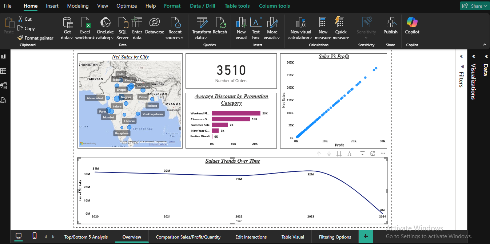
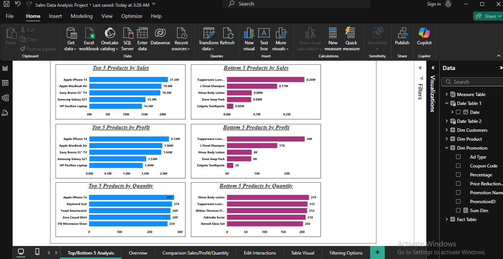
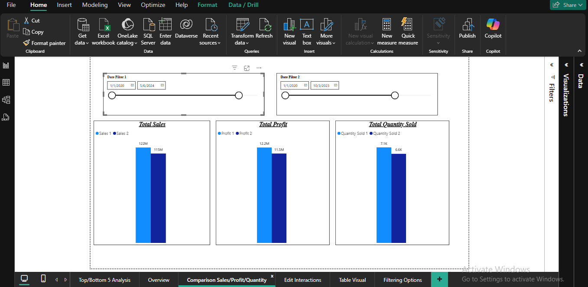
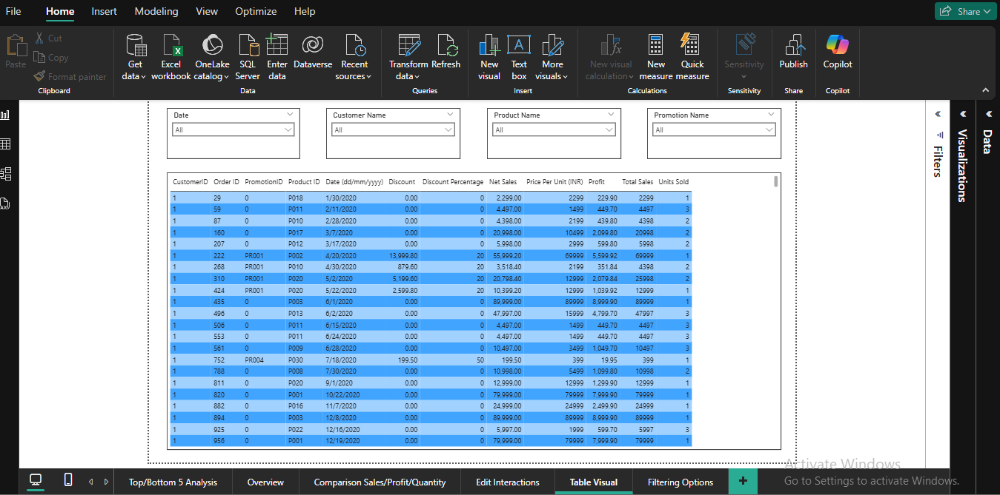

# Sales-Data-Analysis-PowerBi
End-to-end Sales Data Analysis using Power BI with interactive dashboards, DAX, and data modeling

[Sales Data Analysis Power BI Report](Power%20BI%20Report/Sales%20Data%20Analysis%20Project.pbix)

## Project Overview This project analyzes sales performance using Power BI. 
The dashboard provides insights into revenue, profit, regional performance, and product-wise trends to support business decision-making.

## Tools & Technologies 
- Power BI
- Excel / CSV
- DAX 
- Data Modeling
- Data Cleaning

## Key Insights
- Identified top-performing regions and products
- Analyzed monthly sales and profit trends
- Compared sales contribution by category
- Highlighted underperforming segments

## Dataset Sales data includes: 
- Order Date  
- Region 
- Product Category 
- Sales 
- Profit 
- Quantity

Dataset file:  
[Store Sales Dataset](Data%20set/Store+Data.xlsx)
  
## Overview Dashboard

### Top & Bottom Products

### Comparison Analysis

### Table View

The Overview dashboard provides a high-level summary of sales performance and key business metrics.

### Key Components:
- **Sales Trend Analysis:**  
  Line chart showing sales trends over time with drill-down functionality (Year → Quarter → Month → Day).
  
- **Sales vs Profit Relationship:**  
  Scatter chart analyzing the correlation between Net Sales and Profit to identify performance patterns.

- **Discount Analysis:**  
  Bar chart displaying average discount offered across different discount categories and promotions.

- **Geographic Sales Distribution:**  
  Map visual showing Net Sales by city, with bubble size representing sales volume.

- **KPI Cards:**  
  - Total Orders  
  - Total Sales  
  - Net Sales  
  - Total Profit  

## Business Insights
- Revenue is driven mainly by a small set of products and regions.
- Seasonal demand impacts sales trends significantly.
- Discounting improves sales volume but negatively affects profit margins.

## Author
Sonali Bhosale
